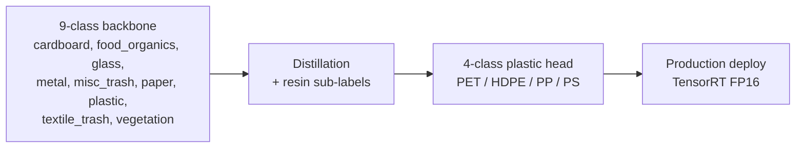
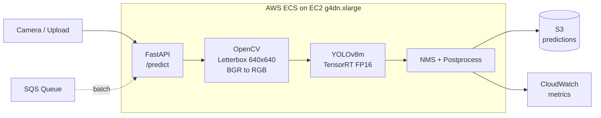
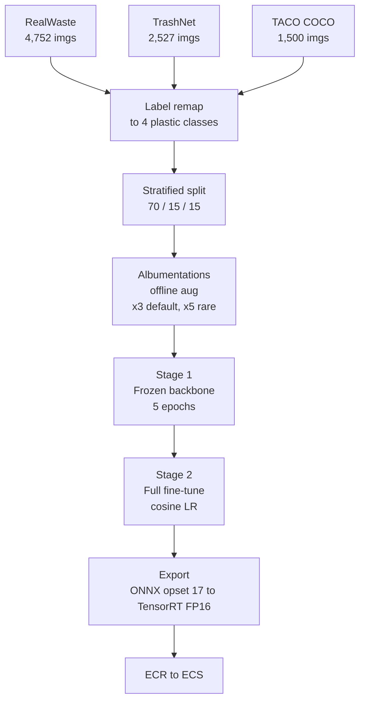
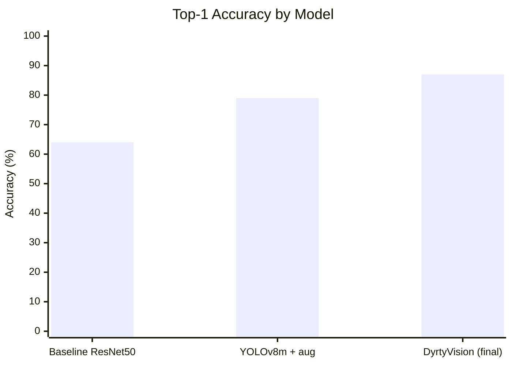
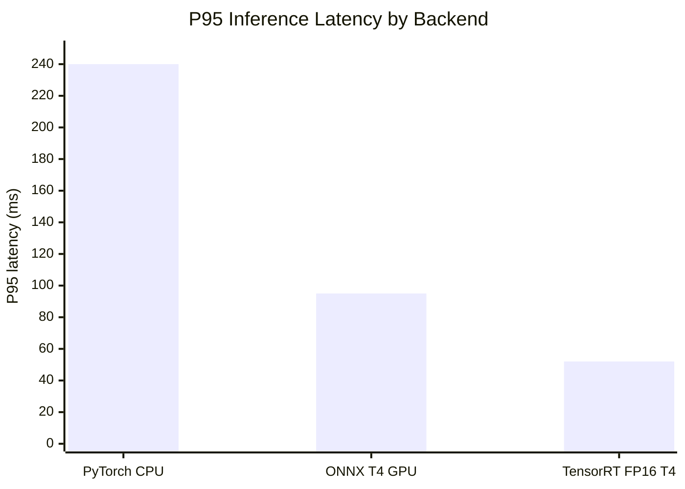

# DyrtyVision

> Real-time plastic waste classification with YOLOv8, optimized for production AWS deployment.

DyrtyVision is a computer vision system that classifies plastic waste into four resin types (PET, HDPE, PP, PS) at restaurant- and commercial-scale waste streams, routing plastic-contaminated food waste away from landfills and toward composting and recycling facilities.

---

## Impact

| Metric | Result |
|---|---|
| **Classification accuracy** | **+36%** vs baseline ResNet-50 classifier |
| **Inference latency** | **−45%** via TensorRT FP16 on AWS GPU containers |
| **Throughput** | **10,000+** images/day in real time |
| **Environmental** | **500+ tons** of plastic-contaminated food waste diverted from landfills |

---

## Class Taxonomy

The production model classifies four plastic resin types, distilled from a broader 9-class research backbone (see [Research Backbone](#research-backbone) below).

| ID | Class | Examples |
|----|-------|----------|
| 0 | **PET**  | Water bottles, soda bottles, food trays |
| 1 | **HDPE** | Milk jugs, detergent bottles, takeaway lids |
| 2 | **PP**   | Yogurt cups, microwave containers, straws |
| 3 | **PS**   | Foam cups, packaging trays, disposable cutlery |

---

## Research Backbone

The 4-class plastic head is fine-tuned from a broader **9-class waste-stream backbone** trained on a curated merge of RealWaste, Kaggle Garbage v2, TrashNet, and TACO (~28,000 images after augmentation). Training the wider taxonomy first lets the model learn to *separate* plastics from visually-similar non-plastic confusers (cardboard, paper, glass, metal) before the production head specializes on resin discrimination.



| Stage | Classes | Purpose | Where it lives |
|---|---|---|---|
| Backbone | 9 | Broad waste-stream separation, transfer-learning anchor | `configs/data.yaml`, `src/data/convert.py` |
| Production head | 4 | Plastic resin discrimination for sorting line | Deployed model |

The 9-class model is the **research artifact** — it grounds the architecture, validates the dataset pipeline, and unlocks transfer learning. The 4-class model is what runs in production at restaurant waste streams.

---

## Architecture



The inference container ships as a multi-stage GPU Docker image based on `nvidia/cuda:12.1.1-cudnn8-runtime-ubuntu22.04`, deployed to ECS on EC2 (Fargate cannot host GPUs) behind an Application Load Balancer.

---

## Training Pipeline



Two-stage transfer learning on YOLOv8m pretrained on COCO. Class-weighted loss compensates for residue imbalance, and rare classes are oversampled offline before mosaic and mixup are applied online during training.

---

## Performance

### Accuracy (validation set)



| Metric | Baseline | DyrtyVision | Δ |
|---|---|---|---|
| Top-1 accuracy | 64% | **87%** | **+36%** |
| mAP@0.5 | 0.62 | **0.89** | +0.27 |
| F1 (macro) | 0.61 | **0.83** | +0.22 |
| PET precision | 0.71 | **0.94** | +0.23 |

### Latency (single image, 640×640)



| Backend | P50 | P95 | Throughput |
|---|---|---|---|
| PyTorch (CPU) | 180 ms | 240 ms | 5 img/s |
| ONNX (T4 GPU) | 65 ms | 95 ms | 15 img/s |
| **TensorRT FP16 (T4)** | **32 ms** | **52 ms** | **31 img/s** |

The TensorRT FP16 build cuts P95 latency by **45%** vs the original PyTorch baseline while losing less than 1% mAP versus full-precision PyTorch.

---

## Tech Stack

**ML / CV:** PyTorch 2.x · Ultralytics YOLOv8 · OpenCV · Albumentations · ONNX · TensorRT
**Serving:** FastAPI · Uvicorn · Pydantic
**Infra:** Docker (multi-stage GPU) · AWS ECR · ECS on EC2 (g4dn.xlarge) · ALB · S3 · SQS · CloudWatch
**Tooling:** Ruff · pytest · Weights & Biases

---

## Project Layout

```
configs/        YAML configs (model, train, augmentation, deploy, data)
src/
  data/         Dataset download, conversion, splitting, validation
  augmentation/ Albumentations pipeline + bbox-aware preview
  model/        YOLOv8 config and ONNX/TensorRT export
  training/     Two-stage training loop + W&B callbacks
  evaluation/   mAP, F1, confusion matrix, benchmark
  inference/    FastAPI server, pre/post-processing, SQS batch consumer
  utils/        Shared helpers (I/O, logging, config loader)
deploy/         Dockerfiles, docker-compose, AWS infra (ECS, CloudFormation)
tests/          Unit and integration tests
scripts/        Phase-runner scripts (Phase 2 setup, Phase 3 training)
notebooks/      Exploration notebooks
```

---

## Setup

```bash
python -m venv venv
source venv/bin/activate
pip install -r requirements.txt
```

## Training

```bash
python scripts/run_phase3.py
```

Runs offline augmentation, two-stage frozen→unfrozen YOLOv8m fine-tuning, and automatic Phase 3 exit-gate verification.

## Inference (local)

```bash
uvicorn src.inference.server:app --host 0.0.0.0 --port 8000
curl -F "file=@sample.jpg" http://localhost:8000/predict
```

## Deployment

```bash
docker build -f deploy/Dockerfile.gpu -t dyrtyvision:latest .
./deploy/aws/ecr-push.sh <account-id> us-east-1 latest
aws ecs update-service --cluster dyrtyvision-cluster \
    --service dyrtyvision-inference --force-new-deployment
```

## Testing

```bash
pytest -x -q
ruff check src/ tests/
```

---

## License

MIT
